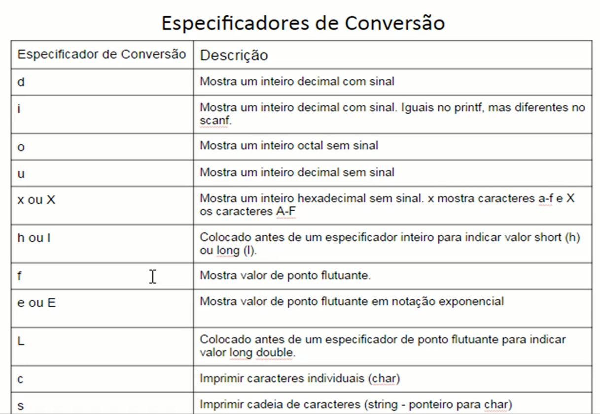
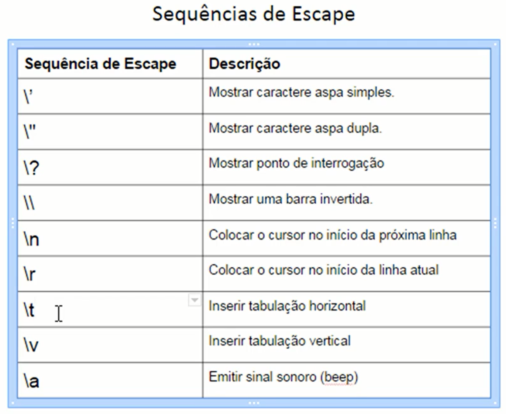
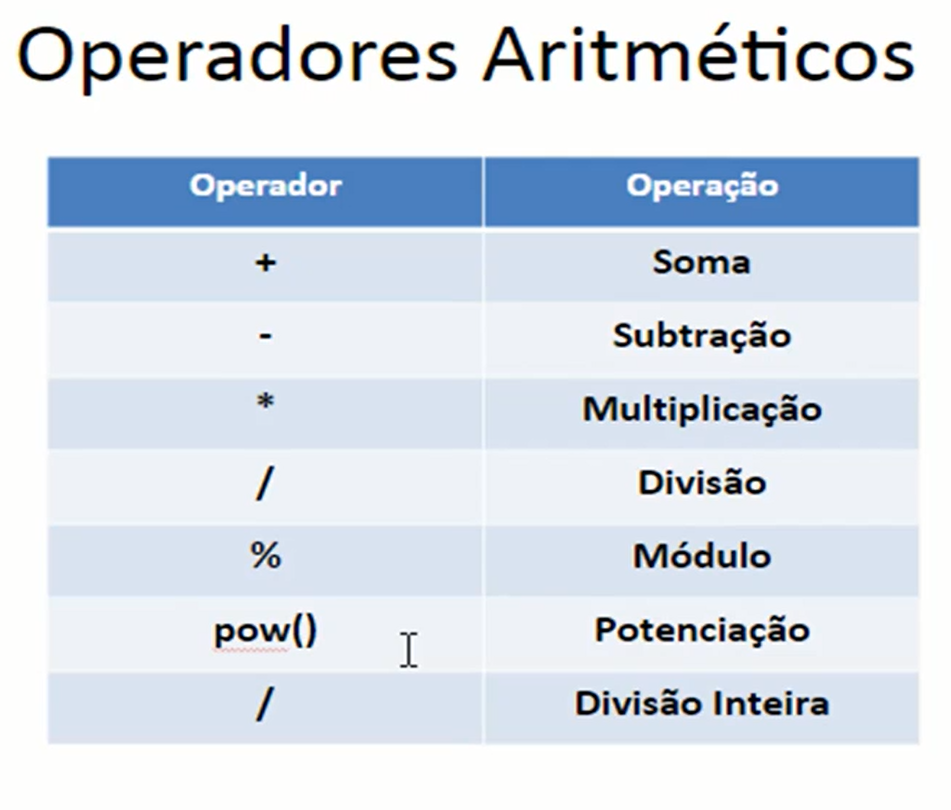

# revisao-linguagem-c
 Repositório criado para revisão da linguagem C para aplicação na disciplina de Estruturas de Dados II. Na aula inicial, foi estabelecido a importancia do domínio de ponteiros em C.

# introdução
Reconhecer a estrutura básica da linguagem C.
1. Diretivas include pré-processador em C que incluem bibliotecas padrão 
2. Função principal
3. Variáveis

# Tipos de Dados em C
Os dados são as informações a serem processadas por um computador. Podem ser classificados em várias categorias, dependendo de suas características.
1. Tipos Básicos
    - Consistem em tipos aritméticos inteiros e de ponto-flutuante.

    - Podemos usar o operador sizeof para descobrir o tamanho de um tipo ou variável.

    - Ponto-flutuante: float (4bytes, 6 casas decimais), double(8bytes, 15 casas decimais), long double(12bytes, 19 casas decimais).

    - Não há um tipo lógico definido na linguagem c original, porém a partir do padrão ISO C99, é possível usar o tipo (mais precisamente, macro) bool. No geral, em C, o valor inteiro 1 pode ser considerado como valor lógico true(verdadeiro) e o inteiro 0 como valor lógico false (falso). Na verdade, qualquer valor diferente de zero será tratado como verdadeiro. Para usarmos o tipo lógico bool precisamos incluir a biblioteda stdbool.h no código do programa.
    Caso usemos uma versão mais antiga do C, podemos "criar" um tipo lógico com o seguinte código:
        - typedef enum {false=0, true=1} logico;

    - Tipo caractere (char): já os tipos literais são tratados em C como valores numericos, e não como literais. Cada caractere possui um correspondente numérico, obedecendo geralmente à tabela ACSII de caracteres. Em C temos o tipo char para representar um caractere literal. Seu tamanho é de 1 byte(8bits), possuindo então valores entre 0 e 255. Caso precisemos armazenar uma cadeia de caracteres (string), usamos arrays do tipo char. Um caractere nulo, representado por \0, sempre indicará o final da cadeia - e ele conta no tamanho total da cadeia.

    - Declaração e Atribuição de Variáveis: uma variável é uma localização na memória RAm do computador que é utilizada para armazenar temporariamente os dados que são utilizados pelo programa. As variáveis possuem algumas características, como: 
        - Identificação("nome"), endereço (na memoria), tipo (de dados), tamanho, valor ("conteúdo").

        - tipos-dados nomes-variáveis, as variáveis devem ser declaradas no início do programa (mas em alguns casos podem ser declaradas em outras partes do programa).

        - Em C é possível realizar atribuição múltipla, na qual um valor é atribuído a uma variável e esta variável é atribuida a outra, em uma única linha de comando. y = x = 10;

    - função printf(string_controle_formatacao, argumentos): 
    

        - O tamanho exato de um campo no qual os dados são mostrados é especificado por um tamanho de campo. Para representar o tamanho do campo desejado devemos inserir um inteiro entre o símbolo % e o especificador de conversão. Caso o campo seja mais largo do que os dados a serem mostrados, os dados serão alinhados à direita no campo.

        - Precisão: A precisão com a qual os dados serão exibidos possui significado diferente para cada tipo. Quando usada com especificadores de conversão de inteiros, a precisão indica o número mínimo de dígitos a serem impressos. Caso o valor a ser mostrado tenha menos dígitos que a precisão especificada, serão prefixados zeros até totalizar o número de dígitos equivalentes. Quando usada com especificadores de conversão de ponto-flutuante e, E ou f, a precisão é o número de dígitos que aparecerão após o ponto decimal. Ao ser usada com especificadores de conversão de string(s), a precisão é o número máximo de caracteres que serão mostrados da cadeia. Para usarmos a precisão, devemos inserir um ponto(.) seguido de um número inteiro que representa a precisão desejada entre o sinal % e o especificador de conversão.

        - Sequência de Escape: A maioria dos caracteres pode ser mostrada diretamente pela função printf. Porém, há alguns caracteres que precisam de formatação especial para serem exibidos, como as aspas duplas (") que delimitam a string de controle em si. Alguns outros caracteres de controle como tabulação e o símbolo de porcentagem devem ser representado por sequência de escapa. Uma sequência de escape é representada por uma barra invertida (\) seguida por um caractere de escape. 
        

        - Entrada de Dados - Função scanf: Lê os valores digitados no teclado, formata-os e os armazena em variáveis na memória.
        - Sintaxe: scanf (string_controle_formatação, argumentos);
        - A string_controle_formatação descreve os formatos das entradas, e os outros argumentos são ponteiros para variáveis nas quais as entradas serão armazenadas. Ao usarmos o scanf indicamos o endereço da variável de armazenamento do dado lido prefixando-a com o caractere **&**.

        - Operadores Aritmético: 
        

2. Tipos de Enumeração
    
3. Tipo void
4. Tipos Derivados (structs, arrays, ponteiros, unions, etc.)

# Ponteiros

Ponteiro é uma variável, mas especial que armazena endereços de posição de memória. 
