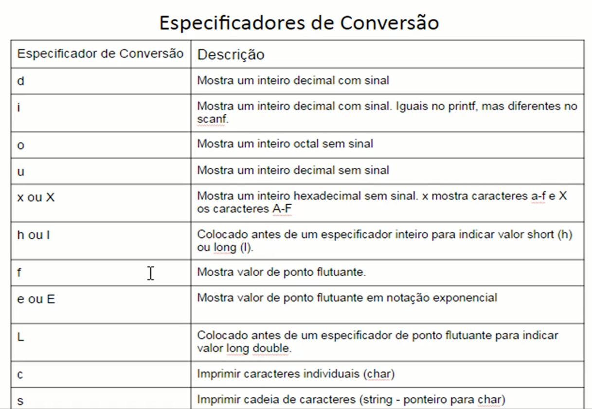

# revisao-linguagem-c
 Repositório criado para revisão da linguagem C para aplicação na disciplina de Estruturas de Dados II. Na aula inicial, foi estabelecido a importancia do domínio de ponteiros em C.

# introdução
Reconhecer a estrutura básica da linguagem C.
1. Diretivas include pré-processador em C que incluem bibliotecas padrão 
2. Função principal
3. Variáveis

# Tipos de Dados em C
Os dados são as informações a serem processadas por um computador. Podem ser classificados em várias categorias, dependendo de suas características.
1. Tipos Básicos
    - Consistem em tipos aritméticos inteiros e de ponto-flutuante.

    - Podemos usar o operador sizeof para descobrir o tamanho de um tipo ou variável.

    - Ponto-flutuante: float (4bytes, 6 casas decimais), double(8bytes, 15 casas decimais), long double(12bytes, 19 casas decimais).

    - Não há um tipo lógico definido na linguagem c original, porém a partir do padrão ISO C99, é possível usar o tipo (mais precisamente, macro) bool. No geral, em C, o valor inteiro 1 pode ser considerado como valor lógico true(verdadeiro) e o inteiro 0 como valor lógico false (falso). Na verdade, qualquer valor diferente de zero será tratado como verdadeiro. Para usarmos o tipo lógico bool precisamos incluir a biblioteda stdbool.h no código do programa.
    Caso usemos uma versão mais antiga do C, podemos "criar" um tipo lógico com o seguinte código:
        - typedef enum {false=0, true=1} logico;

    - Tipo caractere (char): já os tipos literais são tratados em C como valores numericos, e não como literais. Cada caractere possui um correspondente numérico, obedecendo geralmente à tabela ACSII de caracteres. Em C temos o tipo char para representar um caractere literal. Seu tamanho é de 1 byte(8bits), possuindo então valores entre 0 e 255. Caso precisemos armazenar uma cadeia de caracteres (string), usamos arrays do tipo char. Um caractere nulo, representado por \0, sempre indicará o final da cadeia - e ele conta no tamanho total da cadeia.

    - Declaração e Atribuição de Variáveis: uma variável é uma localização na memória RAm do computador que é utilizada para armazenar temporariamente os dados que são utilizados pelo programa. As variáveis possuem algumas características, como: 
        - Identificação("nome"), endereço (na memoria), tipo (de dados), tamanho, valor ("conteúdo").
        - tipos-dados nomes-variáveis, as variáveis devem ser declaradas no início do programa (mas em alguns casos podem ser declaradas em outras partes do programa).
        - Em C é possível realizar atribuição múltipla, na qual um valor é atribuído a uma variável e esta variável é atribuida a outra, em uma única linha de comando. y = x = 10;

    - função printf(string_controle_formatacao, argumentos): 
    
  

2. Tipos de Enumeração
    
3. Tipo void
4. Tipos Derivados (structs, arrays, ponteiros, unions, etc.)

# Ponteiros
